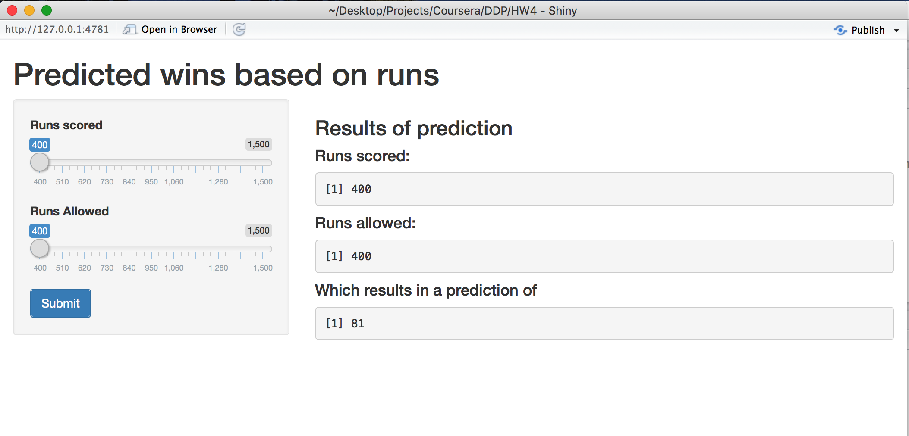

## *Coursera* Developing Data Products Homework 4

#### This app has been deployed to [`shinyapps.io`](https://butterflyology.shinyapps.io/pythagorean_expectation/)

This is an app developed for the final project in the Developing Data Products *Coursera* module.

This `Shiny` app uses the Bill James' Pythagorean Formula and predicts the number of wins over a 162 games season given a user provided number of runs scored and runs allowed.

There are two sliders on the left side of the app:

- `Runs scored` - Slide the button to the number of runs the team scores.
- `Runs allowed` - Slide the button to the number of runs the team allowed.

On the right side of the app are three outputs:

- `Runs scored:` - The number of runs scored selected using the slider.
- `Runs allowed:` - The number of runs allowed selected using the slider.
- `Prediction:` - The predicted number of wins the team will have given the two inputs.

Important things in this directory:

- `Expected_wins.html` - The rendered `.html`.
- `Expected_wins.Rmd` - The `RMarkdown` ioslides file used to make the above `.html`.
- `HW4.RProj` - The `RStudio` project file.
- <kbd>images/</kbd>
  - `App_screen_shot.png` - The screen shot used in the `README.md` file.
- `README.md` - This here file.
- <kbd>rsconnect/</kbd> - The directory that contains important things for `shinyapps.io`.
- `server.R` - The server half of the `shiny` app.
- `ui.R` - The user interface half od the `shiny` app.

Major commit history:

1. 2017-10-04 - Initial commit; working shiny app upload; added slides for presentation.
